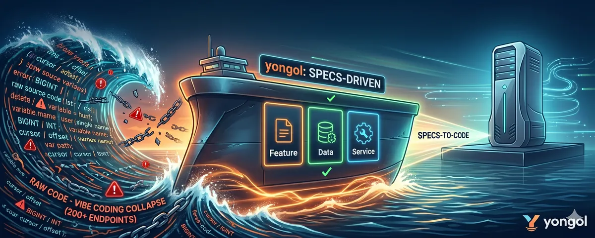

# yongol

<p align="center">
  
</p>

[](https://github.com/park-jun-woo/yongol/releases)
[](LICENSE)
[](https://skills.sh/park-jun-woo/yongol)

> **Recommended:** [Claude Code](https://claude.ai/code). Tested and optimized for Claude Code.

The keel of your AI-coded SaaS.

**Add 10 endpoints to a 100-endpoint codebase in 30 minutes. Nothing breaks.**

Vibe coding hits a wall around 200 endpoints: the AI loses the global picture, patterns drift, and the 201st feature costs 10× the 21st. yongol shifts the AI workload from generated code to declarative SSOTs (10 specialized specs, ~10× context compression) and catches cross-layer drift before it compiles.

**Harness with reins** — not a bigger model, but a tighter harness. Deterministic validators judge every output, ratchets enforce progress, and the machine decides when it's done.

---

## Benchmark: ZenFlow (multi-tenant workflow automation SaaS)

| Stage | Description | Time | Cumulative |
|---|---|---:|---:|
| Initial build | 10 endpoints, 6 tables, auth, state machine | 13 min | 13 min |
| + Versioning | workflow clone, version list | 6 min | 19 min |
| + Webhooks | webhook CRUD, queue backend | 6 min | 25 min |
| + Template marketplace | cursor pagination, cross-org clone | 3 min | 28 min |
| + File attachments | execution reports, file backend | 4 min | 32 min |
| + Scheduling | cron scheduling, session backend | 6 min | 38 min |
| + Audit logs | offset pagination, cache backend | 3 min | 41 min |
| + Dashboard | relation enrichment, func response types | 7 min | 48 min |
| + Batch operations | jsonb batch insert | 14 min | 62 min |
| + External API | geocoding func, column additions | 3 min | 65 min |
| + Conditional update | sentinel pattern, auto-assign | 4 min | 69 min |

**Final: 32 endpoints, 14 tables, 47 hurl requests. 11/11 stages green.**

Adding features never slowed down. Existing tests never broke.

[Opus 4.7 benchmark](examples/zenflow/opus4_7/REPORT.md) — 32 endpoints, 14 tables, 47 hurl requests, ~69 min.
[Sonnet 4.6 benchmark](examples/zenflow/sonnet4_6/REPORT.md) — 32 endpoints, 9 tables, 37 hurl requests, ~43 min.

---

A full-stack SSOT orchestrator. Validates the consistency of 10 declarative sources and generates code from them.

> **Status:** Go+Gin backend generation is **Beta** — functional end-to-end. React frontend generation is **Alpha** (work in progress).

## Quick Start

### Option 1: Install as a skill (recommended)

```bash
npx skills add park-jun-woo/yongol
```

Then invoke the skill in Claude Code:

```
/yongol Build a multi-tenant todo SaaS with auth and CRUD.
```

The skill loads the manual automatically. No need to read files manually.

### Option 2: Clone the repo

Requires **Go 1.25+** and **gcc** (cgo dependency: `pg_query_go` links `libpg_query` for DDL parsing).

```bash
git clone https://github.com/park-jun-woo/yongol.git
cd yongol && make install
```

> 💬 *"Read yongol/manual-for-ai.md and build the spec in yongol/examples/zenflow/zenflow.md. Run `yongol next specs/` and keep fixing until all validations pass."*

```
## Validation

✓ manifest
✓ openapi
✓ ddl
✓ query
✓ ssac
✓ statemachine
✓ rego
✓ hurl
✓ funcspec
✓ openapi_ddl
✓ openapi_ssac
✓ hurl_openapi
✓ hurl_statemachine
✓ hurl_manifest
✓ openapi_manifest
✓ ssac_ddl
✓ ssac_statemachine
✓ ssac_func
✓ ssac_manifest
✓ ssac_rego
✓ ssac_authz
✓ ssac_sqlc
✓ ddl_statemachine
✓ ddl_rego
✓ rego_manifest
✓ stml_openapi

0 errors, 0 warnings
```

```bash
yongol chain ExecuteWorkflow examples/zenflow
```

```
── Feature Chain: ExecuteWorkflow ──

  OpenAPI    api/openapi.yaml                POST /workflows/{id}/execute
  SSaC       service/workflow/execute_workflow.ssac   @get @empty @auth @state @call @publish @response
  DDL        db/workflows.sql                CREATE TABLE workflows
  DDL        db/execution_logs.sql           CREATE TABLE execution_logs
  Rego       policy/authz.rego               resource: workflow
  StateDiag  states/workflow.md              diagram: workflow → ExecuteWorkflow
  FuncSpec   func/billing/check_credits.go   @func billing.CheckCredits
  FuncSpec   func/billing/deduct_credit.go   @func billing.DeductCredit
  FuncSpec   func/worker/process_actions.go  @func worker.ProcessActions
  FuncSpec   func/webhook/deliver.go         @func webhook.Deliver
  Hurl       tests/scenario-happy-path.hurl  scenario: scenario-happy-path.hurl
```

## Using it with AI

Just run `yongol next specs/`. It shows one error at a time with the file location and tells the AI exactly what to fix and what to run next. The loop continues until all validations pass.

```
$ yongol next specs/

[ERROR] DDL-003: users.id must be BIGINT, got INT
  file: specs/db/users.sql:2
  ▶ Fix this error. Then run `yongol next specs/`.
```

When all errors are resolved:

```
$ yongol next specs/

✓ All validations passed. 0 errors.
```

Use `yongol validate specs/` to see all errors at once.

## The 10 SSOT Sources

```
specs/
├── features.yaml              → feature catalog (optional, cross-validates with OpenAPI)
├── manifest.yaml              → project configuration (required)
├── api/openapi.yaml           → OpenAPI 3.x
├── db/*.sql                   → SQL DDL + sqlc queries
├── service/**/*.ssac          → SSaC — service flow decisions (yongol's keystone DSL)
├── func/<pkg>/*.go            → custom function implementations (optional)
├── states/*.md                → Mermaid stateDiagram (state transitions)
├── policy/*.rego              → OPA Rego (authorization)
├── tests/smoke.hurl           → user-owned smoke (write it yourself)
├── tests/scenario-*.hurl      → user-owned business scenarios
├── tests/invariant-*.hurl     → user-owned cross-endpoint invariants
├── frontend/*.html            → STML — declarative page specs (data-* attributes)
└── frontend/components/*.tsx  → custom React components (optional)
```

Every layer uses `operationId` as a keystone — a single PascalCase identifier chains every layer together. `yongol chain <operationId>` walks the whole chain in one command.

## Why AI doesn't get lost

Tell the AI "add a feature" and context collapses as the project grows. yongol sets up 8 SSOTs that reference each other, and `validate` surfaces every inconsistency on the spot. The AI writes freely; leaving the rails fails validation. Freedom on rails.

## Why SSOT + validate

**The drift you actually hit.** A typical source file mixes three things at once:

- **User decisions** — this column is `BIGINT`, this endpoint is owner-only, pagination is cursor
- **Business logic** — pricing, workflows, lifecycle rules
- **Implementation details** — variable names, library call order, error wrapping

When an AI reads that code, it cannot tell which line is a decision and which is a detail. So when it "refactors" or "cleans up," it quietly overwrites decisions thinking they were details — and the user does not notice until the behavior is already wrong. This is what makes vibe coding break around the 200-endpoint mark, and **a larger model does not fix it**: the medium (raw code) simply does not preserve decisions, so every model eventually loses them.

**SSOT keeps decisions out of the code.** Each SSOT file holds *only* user decisions, with implementation explicitly excluded:

- DDL → data-model decisions (tables, columns, types, constraints)
- OpenAPI → API contract decisions
- SSaC → service-flow decisions
- Rego → authorization decisions
- … 10 sources total

The AI authors and edits SSOTs. Code is re-rendered from them on every `yongol generate`. Decisions live permanently in the SSOTs; the code is a disposable projection.

**`validate` keeps the SSOTs themselves consistent.** Decisions are spread across 9 files, so the SSOTs can drift against each other (DDL says `BIGINT`, OpenAPI says `string`). A contradicted SSOT is a corrupted decision — the rendered code will drift even if the AI never touched the code directly. `yongol validate` runs ~287 cross-SSOT rules and refuses to compile until every contradiction is resolved.

**Net effect.** SSOT preserves the decisions; `validate` preserves their integrity. Together they make decision survival independent of model size — a small LLM editing only SSOTs, with precise validate diagnostics on every miss, sustains the same decision integrity a much larger model would, and yongol re-renders the code deterministically from there.

## Why SSaC is a custom DSL

Of yongol's 10 SSOT sources, 8 are industry standards (OpenAPI, SQL DDL, sqlc, Rego, Mermaid, Hurl, manifest YAML). SSaC and STML are yongol inventions. SSaC — Service Sequence as Code — captures service flow decisions. STML — Semantic Template Markup Language — captures frontend page structure as HTML with `data-*` attributes.

**The gap SSaC fills.** Consider the spectrum of declarative tools. On one end sit contract standards (OpenAPI, SQL, Rego) that declare *what* but not *in what order*. On the other end sit workflow runtimes (Temporal, Inngest, Restate) that are *code* — decisions and implementation details remix in the same file. SSaC occupies the empty seat between them: "what happens inside one endpoint, in what order, and with what guards."

That seat is empty for a reason. No existing standard fits it:

- **Business-process standards (BPMN, DMN)** target business analysts, not developers. Their surface area explodes to serve that audience, and their graphics-first tooling is incompatible with text-based SSOT.
- **Workflow runtimes (Temporal, Inngest, Restate)** are code. Decisions and implementation details re-merge in the same file, and runtime concerns (determinism, replay) leak into the SSOT layer.
- **API standards (OpenAPI)** describe the contract — request shape, response shape, status codes — but not the flow between receiving the request and sending the response.
- **Policy standards (Rego, Cedar)** describe authorization rules but cannot express *why* a particular sequence of steps is ordered the way it is.

The industry did not overlook this gap; the gap had no economic pressure to fill. Before AI codegen, there was no reason to freeze service flow as a decision artifact — you just wrote the code, and nobody needed to distinguish decisions from details. That distinction became expensive only when LLMs started refactoring large codebases and silently overwriting decisions they mistook for implementation details. **A new problem demands a new medium.**

**Why custom is an advantage, not a compromise.**

1. **Controlled vocabulary.** SSaC's full annotation set is under 20 keywords. No borrowed standard achieves this economy. LLM-friendliness is not about pre-training familiarity; it is about in-context learnability — and a sub-20-keyword vocabulary with a one-page manual is the ceiling of that metric.
2. **Validation precision.** Because SSaC is small and purpose-built, cross-SSOT rules (SSaC ↔ DDL, SSaC ↔ Rego, SSaC ↔ OpenAPI, SSaC ↔ FuncSpec) resolve cleanly without static analysis. Borrowing a standard would immediately lose this precision.
3. **Evolvability.** When SSaC lacks an annotation, adding one is a single PR. Standards do not allow that — you cannot inject `@yongol_auth` into the Temporal SDK.

**The cost of custom.** SSaC is not free. The manual must be maintained, and every LLM encountering SSaC for the first time pays an in-context learning cost. [`manual-for-ai.md`](manual-for-ai.md) exists to minimize that cost, and the cheatsheet below is designed so that an LLM absorbs the full vocabulary in a single pass.

### SSaC Cheatsheet

**Annotations** — the complete vocabulary:

| Annotation | Purpose | Format |
|---|---|---|
| `@get` | Read from DB | `Type var = Model.Method({args})` |
| `@post` | Create row | `Type var = Model.Method({args})` |
| `@put` | Update row (no return) | `Model.Method({args})` |
| `@delete` | Delete row | `Model.Method({args})` |
| `@empty` | Guard nil → 404 | `var "message" [STATUS]` |
| `@exists` | Guard not-nil → 409 | `var "message" [STATUS]` |
| `@auth` | Authorization check | `"action" "resource" {inputs} "message" [STATUS]` |
| `@state` | State-machine transition | `diagram {inputs} "transition" "message" [STATUS]` |
| `@call` | Call a function | `[Type var =] pkg.Func({args})` |
| `@eval` | Predicate guard (true → error) | `pkg.Func({args}) "message" STATUS` |
| `@publish` | Publish to queue | `"topic" {payload}` |
| `@subscribe` | Queue-triggered function | `"topic"` |
| `@verify-password` | Login with timing defense | `Model.col=source Model.hash vs source -> var STATUS "msg"` |
| `@response` | Return JSON | `{ field: var, ... }` or `var` |
| `@no-pagination` | Exempt from pagination rule | *(function-level)* |
| `@state-neutral` | Exempt from state-machine rule | *(function-level)* |

**Complete example** — AcceptProposal (auth + dual state machine + escrow + queue):

```go
package service

import "github.com/org/project/internal/billing"

// @get Proposal p = Proposal.FindByID({ID: request.id})
// @empty p "Proposal not found" 404
// @get Gig gig = Gig.FindByID({ID: p.GigID})
// @empty gig "Gig not found" 404
// @auth "AcceptProposal" "gig" {ResourceID: request.id} "Forbidden" 403
// @state proposal {status: p.Status} "AcceptProposal" "Cannot accept" 409
// @state gig {status: gig.Status} "AcceptProposal" "Cannot accept on gig" 409
// @put Proposal.UpdateStatus({ID: p.ID, Status: "accepted"})
// @put Gig.AssignFreelancer({ID: gig.ID, FreelancerID: p.FreelancerID, Status: "in_progress"})
// @call billing.HoldEscrowResponse escrow = billing.HoldEscrow({GigID: gig.ID, Amount: gig.Budget})
// @publish "proposal.accepted" {GigID: gig.ID, FreelancerID: p.FreelancerID}
// @get Proposal updated = Proposal.FindByID({ID: p.ID})
// @response { proposal: updated }
func AcceptProposal() {}
```

16 lines. 10 annotations. Two state machines, authorization, escrow, queue event, and a response — every decision visible, every detail absent. Full syntax reference: [`docs/ssac.md`](docs/ssac.md).

## Can I edit the generated code?

Yes. `yongol generate` **preserves** user edits on re-run:

- Every generated Go file carries a `//yg:checked llm=yongol-gen hash=<8hex>` annotation.
- If the recomputed hash drifts from the annotation, the file is considered **preserved** and skipped on the next `generate`.
- `yongol status` reports preserved files and any contract drift (`PRV-01`/`PRV-02` ERRORs).
- Intent can be recorded with `//yg:preserve reason="..."` (optional). Releasing preservation is just file deletion.

The full contract, the PRV-10~17 runtime guards, and CLI usage are documented in [`docs/PRESERVE.md`](docs/PRESERVE.md).

## Commands

### `yongol init <ProjectID> <features.yaml> ["description"]`

Reads a `features.yaml` file and scaffolds SSOT stubs — manifest, OpenAPI with
operationId stubs, SSaC stub files, authz Rego rules, Hurl smoke requests,
sqlc config, and a `specs/.yongol` hash lock — so the project is ready for
iterative feature implementation via `yongol validate specs`.

```bash
yongol init Myapp features.yaml "My workflow automation SaaS"
cd Myapp && yongol validate specs     # 0 errors
```

The description argument is optional; when omitted it defaults to
`<ProjectID> project`.

Flags: `--dir <path>` (target directory, defaults to `./<ProjectID>`),
`--module <go-module>` (overrides the auto-detected Go module path),
`-f, --force` (allow writing into a non-empty directory).

### `yongol features add <features.yaml>`

Compares the given features.yaml with the existing `specs/features.yaml`,
generates SSaC stub files for new operations, replaces `specs/features.yaml`,
and updates the `.yongol` hash. Already existing ops are skipped.

```bash
yongol features add new_features.yaml
```

### `yongol features remove <operationId> [...] [--yes]`

Removes the specified operationIds from `specs/features.yaml`, deletes
their SSaC stub files, and updates the `.yongol` hash. Without `--yes`,
shows the deletion plan and asks for confirmation.

```bash
yongol features remove ExportWorkflow ImportWorkflow --yes
```

### `yongol validate <specs-dir>`

Individual SSOT validation followed by cross-layer consistency checks.

```
## Validation

✓ manifest
✓ openapi
✓ ddl
✓ query
✓ ssac
✓ statemachine
✓ rego
✓ hurl
✓ funcspec
✓ openapi_ddl
✓ openapi_ssac
✓ hurl_openapi
✓ hurl_statemachine
✓ hurl_manifest
✓ openapi_manifest
✓ ssac_ddl
✓ ssac_statemachine
✓ ssac_func
✓ ssac_manifest
✓ ssac_rego
✓ ssac_authz
✓ ssac_sqlc
✓ ddl_statemachine
✓ ddl_rego
✓ rego_manifest
✓ stml_openapi

0 errors, 0 warnings
```

### `yongol generate <specs-dir> <artifacts-dir>`

Generates code from every SSOT after validation succeeds.

```bash
yongol generate <specs-dir> <artifacts-dir>
```

### `yongol chain <operationId> <specs-dir>`

Traces every SSOT node connected to a single API operation.

```
── Feature Chain: AcceptProposal ──

  OpenAPI    api/openapi.yaml:296                          POST /proposals/{id}/accept
  SSaC       service/proposal/accept_proposal.ssac:19      @get @empty @auth @state @put @call @post @response
  DDL        db/gigs.sql:1                                 CREATE TABLE gigs
  DDL        db/proposals.sql:1                            CREATE TABLE proposals
  DDL        db/transactions.sql:1                         CREATE TABLE transactions
  Rego       policy/authz.rego:3                           resource: gig
  StateDiag  states/gig.md:7                               diagram: gig → AcceptProposal
  StateDiag  states/proposal.md:6                          diagram: proposal → AcceptProposal
  FuncSpec   func/billing/hold_escrow.go:8                 @func billing.HoldEscrow
  Hurl       tests/scenario-gig-lifecycle.hurl:4           scenario: scenario-gig-lifecycle.hurl
```

### `yongol import <openapi-source> <output-dir>`

Generates a Go client package from an external OpenAPI document (Stripe, GitHub, …).

```bash
yongol import <openapi-source> <output-dir>
yongol import https://api.stripe.com/openapi.yaml ./external/
```

Call the generated functions from SSaC as `@call <pkg>.<Func>({...})`.

## Cross-Validation

Individual tools (SSaC, STML) validate their own layer. yongol catches inconsistencies **between** layers:

- **manifest.yaml ↔ OpenAPI** — middleware names match securitySchemes keys
- **OpenAPI parameters ↔ DDL** — referenced columns exist in tables
- **SSaC `@result` ↔ DDL** — result types match DDL-derived models
- **SSaC args ↔ DDL** — argument field names match table columns
- **States ↔ SSaC** — transition events map to SSaC functions
- **States ↔ DDL** — state fields map to DDL columns
- **States ↔ OpenAPI** — transition events match operationIds
- **Policy ↔ SSaC** — `@auth` (action, resource) pairs match Rego allow rules
- **Policy ↔ DDL** — `@ownership` table/column references exist
- **Policy ↔ States** — state transitions with `@auth` have Rego rules
- **Hurl ↔ OpenAPI** — URL/method/status/request+response fields (XOH-01~04, XOH-08~09), status code coverage (XOH-12), SSaC guard error path + happy path coverage (XOH-13)
- **Hurl ↔ State Machine** — call order vs declared transitions (XOH-05)
- **Hurl ↔ Manifest** — auth precondition + CSRF headers (XOH-06~07)
- **Queue** — `@publish` topics match `@subscribe` functions, payload fields agree
- **Func ↔ SSaC** — `@call` references have implementations, arg count/types match
- **STML ↔ OpenAPI** — `data-fetch`/`data-action` ↔ operationId (TM-01/02), `data-param-*` ↔ parameters (TM-04), `data-field` ↔ request body (TM-05), `data-bind` ↔ response schema (TM-06)

## Default Functions (pkg/)

Built-ins callable from SSaC via `@call`:

| Package | Function | Description |
|---|---|---|
| `auth` | `hashPassword` | bcrypt hashing |
| `auth` | `verifyPassword` | bcrypt verification |
| `auth` | `issueToken` | JWT access token (24h) |
| `auth` | `verifyToken` | JWT verification + claim extraction |
| `auth` | `refreshToken` | refresh token (7d) |
| `auth` | `generateResetToken` | password-reset token |
| `crypto` | `encrypt` | AES-256-GCM encryption |
| `crypto` | `decrypt` | AES-256-GCM decryption |
| `crypto` | `generateOTP` | TOTP secret + QR URL |
| `crypto` | `verifyOTP` | TOTP verification |
| `storage` | `uploadFile` | S3 upload |
| `storage` | `deleteFile` | S3 delete |
| `storage` | `presignURL` | S3 presigned URL |
| `mail` | `sendEmail` | SMTP email |
| `mail` | `sendTemplateEmail` | HTML template email |
| `text` | `generateSlug` | Unicode → URL slug |
| `text` | `sanitizeHTML` | XSS-safe HTML sanitization |
| `text` | `truncateText` | Unicode-safe truncation |
| `image` | `ogImage` | OG image generation (1200×630) |
| `image` | `thumbnail` | thumbnail generation (200×200) |

Place a custom implementation under `specs/<project>/func/<pkg>/` to override a built-in.

## Built-in Models (pkg/)

Package-level `@model` interfaces for non-DDL I/O. Configured via `manifest.yaml`.

| Package | Interface | Backends | SSaC usage |
|---|---|---|---|
| `session` | `SessionModel` (Set/Get/Delete + TTL) | PostgreSQL, Memory | `session.Session.Get({key: ...})` |
| `cache` | `CacheModel` (Set/Get/Delete + TTL) | PostgreSQL, Memory | `cache.Cache.Set({key: ..., value: ..., ttl: ...})` |
| `file` | `FileModel` (Upload/Download/Delete) | S3, LocalFile | `file.File.Upload({key: ..., body: ...})` |
| `queue` | singleton Pub/Sub (Publish/Subscribe) | PostgreSQL, Memory | `@publish "topic" {payload}` |

## DDL migration auto-emission

`yongol generate` detects changes in DDL (`specs/db/*.sql`) and emits numbered migration files into `artifacts/db/migrations/` automatically. There is **no separate command** — this runs as a pipeline stage inside `generate` (after validate, before backend codegen).

```
specs/db/
└── users.sql                  # SSOT — user edits live here (pure SSOT; no yongol state)

artifacts/db/
├── .latest_schema.sql         # baseline snapshot (yongol-managed, Phase010 / BUG-034)
└── migrations/
    ├── 0001_initial.up.sql        # first generate
    ├── 0001_initial.down.sql      # stub — yongol does not auto-generate reverse migrations
    ├── 0002_add_users_email.up.sql    # incremental ALTER after that
    └── 0002_add_users_email.down.sql  # stub
```

The baseline sits **next to** `migrations/` (not inside it) so external migration tools (`golang-migrate` / `flyway` / `goose`) that scan `migrations/` never mistake the dotfile for a migration. `rm -rf arts/` resets baseline and migrations atomically, eliminating BUG-034's orphan edge case.

The `.up.sql` / `.down.sql` pair matches [golang-migrate](https://github.com/golang-migrate/migrate)'s expected layout. `.down.sql` files are no-op stubs — to roll back, check out the previous `specs/` revision and re-run `yongol generate`.

Ambiguous changes (column rename, type cast, NOT NULL backfill) are disambiguated via DDL comment hints (`-- @rename`, `-- @cast`, `-- @backfill`, `-- @data_migration`, `-- @allow_destructive`). Six rules (`MIG-001`..`MIG-006`) gate risky operations.

Applying migrations to the actual database is delegated to standard tools (`golang-migrate`, `flyway`, …). Full syntax and end-to-end scenarios are in [`docs/MIGRATION.md`](docs/MIGRATION.md).

## Runtime Testing

All hurl tests are **user-authored**. Write them under `specs/tests/`;
`yongol generate` mirrors that directory into `arts/tests/` without
modification. At validate time, rules **XOH-01 ~ XOH-09** cross-check
your Hurl against OpenAPI, the state machine, and manifest.auth
(rulebook sections R / R2 / R3 / R4).

See [`docs/scenario.md`](docs/scenario.md) for authoring guidance and
cookie / bearer templates you can copy as starting points.

```bash
hurl --test --variable host=http://localhost:8080 artifacts/my-project/tests/*.hurl
```

- **smoke.hurl** — endpoint smoke (user-authored)
- **scenario-\*.hurl** — business scenario tests (user-authored)
- **invariant-\*.hurl** — cross-endpoint invariant tests (user-authored)

## Architecture

SSaC is integrated into `pkg/parser/ssac/` + `pkg/validate/ssac*/`. STML is the 9th SSOT — `.html` files with `data-*` attributes are parsed by `pkg/parser/stml/` and cross-validated against OpenAPI (`pkg/validate/stml_openapi/`). STML pages are compiled to React TSX by `pkg/generate/react/stml/`.

All SSOTs are parsed exactly once per CLI invocation via `ParseAll()` and shared across the validate, generate, and chain pipelines.

## Prior Art

yongol applies multi-model consistency checking — mature research in Model-Driven Engineering for 20+ years — to the modern web SaaS stack, using industry-standard declarative formats (OpenAPI, SQL, Rego, Mermaid, Hurl) plus STML instead of custom metamodels (UML/SysML). The moat is not the idea; it is packaging the idea as a developer-facing OSS CLI that works with tools teams already use.

**Why not an existing standard for the service layer?** BPMN/DMN model business processes for analyst audiences — their surface area is too large and their graphics-first tooling is incompatible with text SSOT. Temporal/Inngest/Restate are workflow *runtimes* — they couple decisions to implementation and import runtime constraints (determinism, replay) into the specification layer. OpenAPI stops at the contract boundary; Rego/Cedar stop at the policy boundary. None of these express the narrow concern SSaC targets: the ordered sequence of decisions inside a single endpoint. See [Why SSaC is a custom DSL](#why-ssac-is-a-custom-dsl) for the full rationale.

## Acknowledgments

yongol is built on top of these projects.

### SSOT foundations

- [OpenAPI Initiative](https://www.openapis.org/) — the API specification standard that bridges frontend and backend
- [sqlc](https://sqlc.dev/) — SQL-first Go code generation; yongol's DDL-as-model philosophy inherits directly from sqlc
- [Open Policy Agent](https://www.openpolicyagent.org/) — policy as code; Rego drives yongol's authorization layer
- [Mermaid](https://mermaid.js.org/) — diagrams as code; state diagrams become runtime state machines

### Code generation & validation

- [oapi-codegen](https://github.com/oapi-codegen/oapi-codegen) — OpenAPI → Go server/types
- [kin-openapi](https://github.com/getkin/kin-openapi) — OpenAPI 3.x parser for Go
- [Hurl](https://hurl.dev/) — plaintext HTTP testing

### Generated code runtime

- [React](https://react.dev/), [React Router](https://reactrouter.com/), [TanStack Query](https://tanstack.com/query), [React Hook Form](https://react-hook-form.com/)
- [Vite](https://vite.dev/), [Tailwind CSS](https://tailwindcss.com/), [TypeScript](https://www.typescriptlang.org/)
- [Gin](https://gin-gonic.com/), [pgx/v5](https://github.com/jackc/pgx)

## License

MIT — see [LICENSE](LICENSE).
