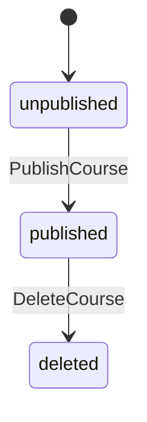

# Mermaid stateDiagram — State Transitions

State-machine SSOT in `stateDiagram-v2` syntax. Each transition label must match the SSaC function name / OpenAPI operationId.

## Location

`<project-root>/states/*.md` — one diagram per file in a ` ```mermaid ` fence.

## yongol Conventions

| Convention | Rule |
|---|---|
| File name = diagram ID | `course.md` -> referenced as `@state course {...}` |
| Transition label | = SSaC funcName = OpenAPI operationId |
| Initial state | `X` in `[*] --> X` must equal the DDL column `DEFAULT` (XDM-28) |

## Minimal Example

````markdown
# CourseState


````

SSaC guard:

```go
// @state course {status: course.Status} "PublishCourse" "Cannot transition"
```

DDL initial-state match:

```sql
CREATE TABLE courses (
    id BIGSERIAL PRIMARY KEY,
    status VARCHAR(32) NOT NULL DEFAULT 'unpublished'  -- matches [*] --> unpublished
);
```

## Multiple Diagrams

One service may have several state machines:

```
states/
├── gig.md          -> "gig"
├── proposal.md     -> "proposal"
└── transaction.md  -> "transaction"
```

```go
// @state gig {status: gig.Status} "AcceptProposal" "..."
// @state proposal {status: proposal.Status} "AcceptProposal" "..."
```

A single operationId can appear across diagrams when multiple states transition together.

## Cross-SSOT Links

| Link | Validation |
|---|---|
| Diagram ID (file name) -> SSaC `@state <id>` | Existence |
| Transition label -> OpenAPI operationId | Identical |
| Transition label -> SSaC funcName | Identical |
| `[*] --> X` -> DDL column DEFAULT | XDM-28 exact match |
| Node names -> DDL CHECK allowed values | Intersection if CHECK exists |

## Further Reading

- [Mermaid stateDiagram-v2](https://mermaid.js.org/syntax/stateDiagram.html)
- [docs/ssac.md](./ssac.md)
- [docs/ddl.md](./ddl.md)
- [docs/openapi.md](./openapi.md)
- [rulebook.md](../rulebook.md)
