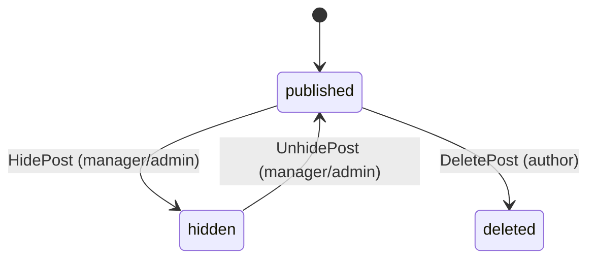
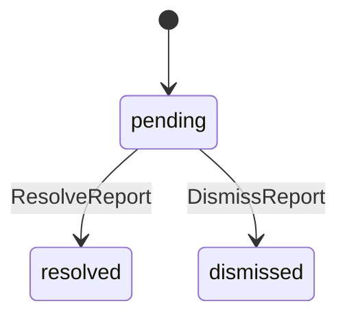
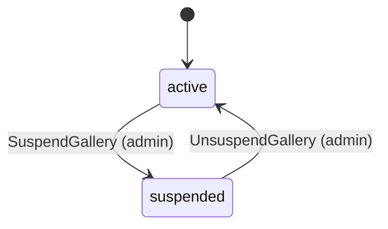

# Communy — DC인사이드 스타일 익명 커뮤니티

## 1. Domain Overview

Communy는 갤러리(게시판) 기반 익명 커뮤니티 서비스다.
사용자는 갤러리에 글을 올리고 댓글을 달며, 추천/비추천으로 여론을 형성한다.
일정 추천 수를 넘긴 글은 "개념글"로 승격되어 전체 메인에 노출된다.

핵심 특성:
- **갤러리 중심 구조** — 주제별 갤러리가 콘텐츠의 최상위 단위
- **고정닉 / 유동닉 공존** — 로그인 사용자(고정닉)와 비밀번호만 입력하는 비로그인 사용자(유동닉)
- **추천/비추천** — 글·댓글에 대한 투표, 개념글 승격 기준
- **갤러리 자치 관리** — 갤러리 매니저가 글 숨김·사용자 차단

## 2. Entity & DDL

```sql
CREATE TABLE users (
    id BIGSERIAL PRIMARY KEY,
    email TEXT UNIQUE NOT NULL,
    password_hash TEXT NOT NULL,
    nickname TEXT UNIQUE NOT NULL,
    role TEXT NOT NULL DEFAULT 'user' CHECK (role IN ('user', 'admin')),
    created_at TIMESTAMPTZ NOT NULL DEFAULT NOW()
);

CREATE TABLE galleries (
    id BIGSERIAL PRIMARY KEY,
    slug TEXT UNIQUE NOT NULL,
    name TEXT NOT NULL,
    description TEXT NOT NULL DEFAULT '',
    category TEXT NOT NULL CHECK (category IN ('major', 'minor')),
    status TEXT NOT NULL DEFAULT 'active' CHECK (status IN ('active', 'suspended')),
    owner_id BIGINT NOT NULL REFERENCES users(id),
    post_count INTEGER NOT NULL DEFAULT 0,
    created_at TIMESTAMPTZ NOT NULL DEFAULT NOW()
);

CREATE TABLE gallery_managers (
    id BIGSERIAL PRIMARY KEY,
    gallery_id BIGINT NOT NULL REFERENCES galleries(id) ON DELETE CASCADE,
    user_id BIGINT NOT NULL REFERENCES users(id),
    role TEXT NOT NULL CHECK (role IN ('sub_owner', 'manager')),
    created_at TIMESTAMPTZ NOT NULL DEFAULT NOW(),
    UNIQUE (gallery_id, user_id)
);

CREATE TABLE posts (
    id BIGSERIAL PRIMARY KEY,
    gallery_id BIGINT NOT NULL REFERENCES galleries(id),
    user_id BIGINT REFERENCES users(id),
    guest_nickname TEXT,
    guest_password_hash TEXT,
    title TEXT NOT NULL,
    body TEXT NOT NULL,
    ip_hash TEXT NOT NULL DEFAULT '',
    status TEXT NOT NULL DEFAULT 'published'
        CHECK (status IN ('published', 'hidden', 'deleted')),
    is_concept BOOLEAN NOT NULL DEFAULT FALSE,
    upvotes INTEGER NOT NULL DEFAULT 0,
    downvotes INTEGER NOT NULL DEFAULT 0,
    comment_count INTEGER NOT NULL DEFAULT 0,
    view_count INTEGER NOT NULL DEFAULT 0,
    created_at TIMESTAMPTZ NOT NULL DEFAULT NOW(),
    CHECK (
        (user_id IS NOT NULL AND guest_nickname IS NULL AND guest_password_hash IS NULL)
        OR (user_id IS NULL AND guest_nickname IS NOT NULL AND guest_password_hash IS NOT NULL)
    )
);

CREATE TABLE comments (
    id BIGSERIAL PRIMARY KEY,
    post_id BIGINT NOT NULL REFERENCES posts(id) ON DELETE CASCADE,
    parent_id BIGINT REFERENCES comments(id),
    user_id BIGINT REFERENCES users(id),
    guest_nickname TEXT,
    guest_password_hash TEXT,
    body TEXT NOT NULL,
    ip_hash TEXT NOT NULL DEFAULT '',
    status TEXT NOT NULL DEFAULT 'published'
        CHECK (status IN ('published', 'hidden', 'deleted')),
    created_at TIMESTAMPTZ NOT NULL DEFAULT NOW(),
    CHECK (
        (user_id IS NOT NULL AND guest_nickname IS NULL AND guest_password_hash IS NULL)
        OR (user_id IS NULL AND guest_nickname IS NOT NULL AND guest_password_hash IS NOT NULL)
    )
);

CREATE TABLE votes (
    id BIGSERIAL PRIMARY KEY,
    post_id BIGINT NOT NULL REFERENCES posts(id) ON DELETE CASCADE,
    user_id BIGINT REFERENCES users(id),
    ip_hash TEXT NOT NULL DEFAULT '',
    vote_type TEXT NOT NULL CHECK (vote_type IN ('up', 'down')),
    created_at TIMESTAMPTZ NOT NULL DEFAULT NOW()
);

CREATE TABLE reports (
    id BIGSERIAL PRIMARY KEY,
    gallery_id BIGINT NOT NULL REFERENCES galleries(id),
    target_type TEXT NOT NULL CHECK (target_type IN ('post', 'comment')),
    target_id BIGINT NOT NULL,
    reporter_id BIGINT REFERENCES users(id),
    reason TEXT NOT NULL,
    status TEXT NOT NULL DEFAULT 'pending'
        CHECK (status IN ('pending', 'resolved', 'dismissed')),
    created_at TIMESTAMPTZ NOT NULL DEFAULT NOW()
);

CREATE TABLE bans (
    id BIGSERIAL PRIMARY KEY,
    gallery_id BIGINT NOT NULL REFERENCES galleries(id) ON DELETE CASCADE,
    user_id BIGINT REFERENCES users(id),
    ip_hash TEXT,
    reason TEXT NOT NULL DEFAULT '',
    expires_at TIMESTAMPTZ,
    created_at TIMESTAMPTZ NOT NULL DEFAULT NOW(),
    CHECK (user_id IS NOT NULL OR ip_hash IS NOT NULL)
);
```

## 3. State Machines

### Post lifecycle



### Report lifecycle



### Gallery lifecycle



## 4. Authorization Rules

```rego
package authz

# @ownership gallery_owner: galleries.owner_id
# @ownership post_author: posts.user_id
# @ownership comment_author: comments.user_id

default allow = false

# --- Gallery ---

allow {
    input.operation == "CreateGallery"
}

allow {
    input.operation == "SuspendGallery"
    input.user.role == "admin"
}

allow {
    input.operation == "UnsuspendGallery"
    input.user.role == "admin"
}

# --- Gallery Management ---

is_gallery_owner {
    input.user.id == input.resource.owner_id
}

is_gallery_manager {
    some m in input.resource.managers
    m.user_id == input.user.id
}

allow {
    input.operation == "AddGalleryManager"
    is_gallery_owner
}

allow {
    input.operation == "RemoveGalleryManager"
    is_gallery_owner
}

# --- Post ---

allow {
    input.operation == "CreatePost"
}

allow {
    input.operation == "ListPosts"
}

allow {
    input.operation == "GetPost"
}

allow {
    input.operation == "DeletePost"
    input.user.id == input.resource.user_id
}

allow {
    input.operation == "HidePost"
    is_gallery_owner
}

allow {
    input.operation == "HidePost"
    is_gallery_manager
}

allow {
    input.operation == "HidePost"
    input.user.role == "admin"
}

allow {
    input.operation == "UnhidePost"
    is_gallery_owner
}

allow {
    input.operation == "UnhidePost"
    is_gallery_manager
}

# --- Comment ---

allow {
    input.operation == "CreateComment"
}

allow {
    input.operation == "ListComments"
}

allow {
    input.operation == "DeleteComment"
    input.user.id == input.resource.user_id
}

allow {
    input.operation == "HideComment"
    is_gallery_owner
}

allow {
    input.operation == "HideComment"
    is_gallery_manager
}

# --- Vote ---

allow {
    input.operation == "VotePost"
}

# --- Report ---

allow {
    input.operation == "CreateReport"
}

allow {
    input.operation == "ListReports"
    is_gallery_owner
}

allow {
    input.operation == "ListReports"
    is_gallery_manager
}

allow {
    input.operation == "ResolveReport"
    is_gallery_owner
}

allow {
    input.operation == "ResolveReport"
    is_gallery_manager
}

allow {
    input.operation == "DismissReport"
    is_gallery_owner
}

# --- Ban ---

allow {
    input.operation == "BanUser"
    is_gallery_owner
}

allow {
    input.operation == "BanUser"
    is_gallery_manager
}

allow {
    input.operation == "UnbanUser"
    is_gallery_owner
}

allow {
    input.operation == "ListBans"
    is_gallery_owner
}

allow {
    input.operation == "ListBans"
    is_gallery_manager
}
```

## 5. API & Business Logic

### Auth

#### POST /auth/register (`Register`)

1. Validate email format and password strength (min 8 chars).
2. Hash password, insert user row.
3. Return user profile (no token — login separately).

#### POST /auth/login (`Login`)

1. Find user by email, verify password hash.
2. Issue JWT with `{ ID, Email, Role }` claims.

### Galleries

#### POST /galleries (`CreateGallery`)

1. Validate slug (lowercase alphanumeric + hyphens, 3-30 chars).
2. Set `owner_id` to current user, `category` from request body.

#### GET /galleries (`ListGalleries`)

Public. Offset pagination with `category` filter.

#### GET /galleries/{slug} (`GetGallery`)

Public. Lookup by slug, include owner nickname.

#### POST /galleries/{id}/suspend (`SuspendGallery`)

Admin only. Transition gallery status to `suspended`.
All new posts and comments are blocked while suspended.

#### POST /galleries/{id}/unsuspend (`UnsuspendGallery`)

Admin only. Transition gallery status back to `active`.

### Gallery Management

#### POST /galleries/{id}/managers (`AddGalleryManager`)

Owner only. Assign user as `sub_owner` or `manager`.

#### DELETE /galleries/{id}/managers/{userId} (`RemoveGalleryManager`)

Owner only. Remove a manager.

#### GET /galleries/{id}/managers (`ListGalleryManagers`)

Public. List gallery management team.

### Posts

#### POST /galleries/{galleryId}/posts (`CreatePost`)

1. Verify gallery status is `active`.
2. If authenticated: set `user_id`. If guest: require `guest_nickname` + `guest_password`, hash the password.
3. Hash client IP for `ip_hash`.
4. Check ban table — reject if user/IP is banned in this gallery.
5. Insert post, increment `galleries.post_count`.

#### GET /galleries/{galleryId}/posts (`ListPosts`)

Public. Offset pagination (`page`, `per_page`). Default sort by `created_at DESC`.
Filter options: `is_concept=true` for 개념글 only.

#### GET /posts/{id} (`GetPost`)

Public. Increment `view_count`. Return post with author info (nickname for 고정닉, `guest_nickname` + IP hash prefix for 유동닉).

#### DELETE /posts/{id} (`DeletePost`)

Author only (for 고정닉: match `user_id`; for 유동닉: require `guest_password` in body and verify hash).
Set status to `deleted`.

#### POST /posts/{id}/hide (`HidePost`)

Gallery owner / manager / admin. Set status to `hidden`.

#### POST /posts/{id}/unhide (`UnhidePost`)

Gallery owner / manager. Set status back to `published`.

### Comments

#### POST /posts/{postId}/comments (`CreateComment`)

1. Verify parent post status is `published` and gallery is `active`.
2. Same 고정닉/유동닉 logic as posts.
3. `parent_id` for reply threading (1-depth only — no nested replies to replies).
4. Increment `posts.comment_count`.

#### GET /posts/{postId}/comments (`ListComments`)

Public. Offset pagination, ordered by `created_at ASC`.
Include `parent_id` for client-side threading.

#### DELETE /comments/{id} (`DeleteComment`)

Author only (same 고정닉/유동닉 verification as post delete).
Set status to `deleted`.

#### POST /comments/{id}/hide (`HideComment`)

Gallery owner / manager. Set status to `hidden`.

### Votes

#### POST /posts/{id}/vote (`VotePost`)

1. Accept `vote_type`: `up` or `down`.
2. Duplicate check: one vote per user (by `user_id` or `ip_hash`) per post.
3. Update `posts.upvotes` or `posts.downvotes` counter.
4. **개념글 승격**: if `upvotes - downvotes >= 10`, set `is_concept = TRUE`.

### Reports

#### POST /posts/{id}/report (`CreateReport`)

1. Accept `reason` (text, max 500 chars).
2. Set `target_type = 'post'`, `target_id = post.id`, `gallery_id` from post.

#### POST /comments/{id}/report (`CreateCommentReport`)

Same as post report but `target_type = 'comment'`.

#### GET /galleries/{id}/reports (`ListReports`)

Gallery owner / manager. Offset pagination, filter by `status`.

#### POST /reports/{id}/resolve (`ResolveReport`)

Gallery owner / manager. Set status to `resolved`. Optionally auto-hide the target content.

#### POST /reports/{id}/dismiss (`DismissReport`)

Gallery owner only. Set status to `dismissed`.

### Bans

#### POST /galleries/{id}/bans (`BanUser`)

Gallery owner / manager. Ban a user (`user_id`) or IP hash. Optional `expires_at` for temporary ban.

#### DELETE /galleries/{id}/bans/{banId} (`UnbanUser`)

Gallery owner only. Remove ban.

#### GET /galleries/{id}/bans (`ListBans`)

Gallery owner / manager. List active bans.

### Feed

#### GET /posts/concept (`ListConceptPosts`)

Public. 전체 개념글 목록. Cross-gallery, offset pagination, sorted by `created_at DESC`.
Only posts with `is_concept = TRUE` and `status = 'published'`.

#### GET /posts/realtime (`ListRealtimePosts`)

Public. 실시간 전체 글 목록. Cross-gallery, cursor pagination, sorted by `created_at DESC`.
Only `status = 'published'`.

## 6. Summary

| Entity | Table | Key Relationships |
|---|---|---|
| 사용자 | `users` | — |
| 갤러리 | `galleries` | `owner_id → users` |
| 갤러리 매니저 | `gallery_managers` | `gallery_id → galleries`, `user_id → users` |
| 게시글 | `posts` | `gallery_id → galleries`, `user_id → users` (nullable) |
| 댓글 | `comments` | `post_id → posts`, `parent_id → comments`, `user_id → users` (nullable) |
| 투표 | `votes` | `post_id → posts`, `user_id → users` (nullable) |
| 신고 | `reports` | `gallery_id → galleries`, `reporter_id → users` (nullable) |
| 차단 | `bans` | `gallery_id → galleries`, `user_id → users` (nullable) |

총 API: 28개 엔드포인트 (Auth 2 + Gallery 7 + Post 6 + Comment 4 + Vote 1 + Report 4 + Ban 3 + Feed 2)
