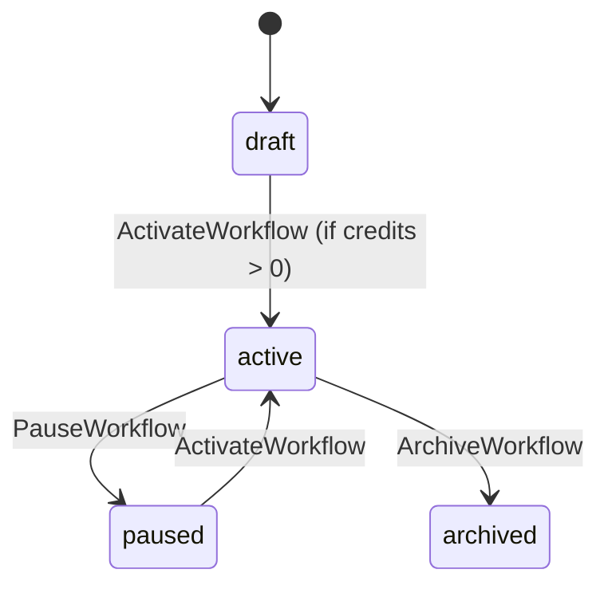

# ZenFlow — Example Project Specification

## 1. Domain Overview

ZenFlow is a multi-tenant workflow-automation SaaS. Organizations design workflows, each running a sequence of actions. Every execution is gated by the organization's subscription plan and remaining credits.

## 2. Entity & DDL

```sql
CREATE TABLE organizations (
    id UUID PRIMARY KEY DEFAULT gen_random_uuid(),
    name TEXT NOT NULL,
    plan_type TEXT CHECK (plan_type IN ('free', 'pro', 'enterprise')),
    credits_balance INTEGER DEFAULT 0
);

CREATE TABLE users (
    id UUID PRIMARY KEY DEFAULT gen_random_uuid(),
    org_id UUID REFERENCES organizations(id),
    email TEXT UNIQUE NOT NULL,
    role TEXT CHECK (role IN ('admin', 'member'))
);

CREATE TABLE workflows (
    id UUID PRIMARY KEY DEFAULT gen_random_uuid(),
    org_id UUID REFERENCES organizations(id),
    title TEXT NOT NULL,
    trigger_event TEXT NOT NULL,
    status TEXT NOT NULL DEFAULT 'draft',
    created_at TIMESTAMP DEFAULT CURRENT_TIMESTAMP
);

CREATE TABLE actions (
    id UUID PRIMARY KEY DEFAULT gen_random_uuid(),
    workflow_id UUID REFERENCES workflows(id) ON DELETE CASCADE,
    type TEXT NOT NULL,
    payload_template JSONB,
    sequence_order INTEGER NOT NULL
);

CREATE TABLE execution_logs (
    id UUID PRIMARY KEY DEFAULT gen_random_uuid(),
    workflow_id UUID REFERENCES workflows(id),
    org_id UUID REFERENCES organizations(id),
    status TEXT,
    credits_spent INTEGER,
    executed_at TIMESTAMP DEFAULT CURRENT_TIMESTAMP
);
```

## 3. State Machine



## 4. Authorization Rules

```rego
package authz

# @ownership organization: organizations.id
# @ownership workflow: workflows.org_id
# @ownership user_org: users.org_id

default allow = false

is_same_org {
    input.user.org_id == input.resource.org_id
}

allow {
    input.operation == "CreateWorkflow"
    input.user.role == "admin"
}

allow {
    input.operation == "ListWorkflows"
    is_same_org
}

allow {
    input.operation == "ActivateWorkflow"
    input.user.role == "admin"
    is_same_org
}
```

## 5. API & Business Logic

### POST /workflows/{id}/activate (`ActivateWorkflow`)

1. Check the organization's `credits_balance`.
2. Return `402 Payment Required` if zero or below.
3. Transition status to `active`.

### POST /workflows/{id}/execute (`ExecuteWorkflow`)

1. `@auth` — enforce tenant isolation.
2. `@state` — verify the workflow is `active`.
3. Load all linked `actions` ordered by `sequence_order`.
4. Loop: `@call worker.processAction`.
5. `@call billing.deductCredit` (deduct 1 credit on success).
6. Record to `execution_logs`.

## 6. Custom Functions

- `processAction(actionType, payload)` — simulates an external API call.
- `checkCredits(orgID)` — returns the current balance.
- `deductCredit(orgID, amount)` — atomic credit deduction.

## 7. E2E Scenario

- **@scenario** Happy Path: Admin creates a workflow, adds two actions, activates it (success), executes it, then verifies the log entry and credit deduction.
- **@invariant** Tenant Breach: a user from Org A requests execution with Org B's `workflow_id` → `403 Forbidden`.
- **@invariant** Insufficient Credits: an organization with zero credits attempts activation → `402 Payment Required`.

## 8. Development Guidelines

1. Read `manual-for-ai.md` at repo root as the sole source of yongol conventions.
2. Author SSOT files in `examples/zenflow/specs/`.
3. Generate code with `yongol generate examples/zenflow/specs examples/zenflow/arts`.
4. Record a start timestamp when you write the first `manifest.yaml` line and measure wall-clock time through the full green chain, in this order:
   1. `yongol validate examples/zenflow/specs` — all SSOTs consistent.
   2. `yongol generate examples/zenflow/specs examples/zenflow/arts` — no ERROR/WARNING.
   3. `go build ./...` inside the generated backend — compiles clean.
   4. Start the backend and run `hurl --test --variable host=http://localhost:8080 examples/zenflow/arts/<project>/tests/smoke.hurl` — every smoke assertion green.

   The benchmark stops at the first run in which all four steps pass end-to-end.
5. Runtime dependencies for the generated backend:
   - Postgres: run via Docker (`docker run -e POSTGRES_PASSWORD=...`); apply emitted migrations with `golang-migrate` or equivalent before starting the backend.
   - Dummy SMTP (if `@call mail.*` is used): run `python3 scripts/dummy-smtp.py` from the yongol repo root (accepts all, discards).
   - Hurl CLI (`hurl`) on PATH for the smoke step above.
6. Build only from `manual-for-ai.md`. Do not consult other full-stack scaffolds, generated code from prior attempts, or unrelated implementations.
7. If `yongol` itself errors, do **not** monkey-patch. Report at `~/.clari/repos/fullend/bugs/BUG000.md` and stop only if blocked outright.
8. On completion, record the timing breakdown (initial build, each incremental add) for benchmarking. and report in `examples/zenflow/REPORT.md`
9. Shell caveat: in a PTY, `!` is history-expanded — avoid it in passwords.
