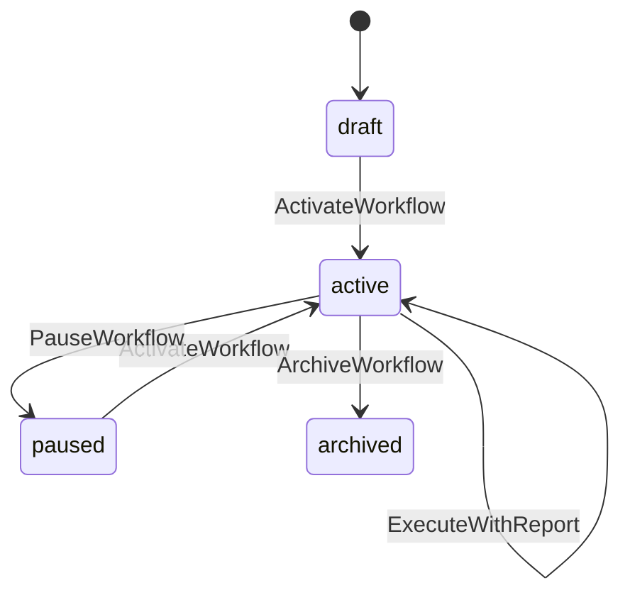

# pkg/generate/gogin/state

Mermaid stateDiagram 에서 **상태 전이 맵 + CanTransition guard 함수**를 생성한다.
SSaC `@state` 시퀀스가 handler 에서 호출하는 런타임 guard.

## 활성 조건

`len(fs.StateDiagrams) > 0`

## 진입점

```go
// generate.go
func Generate(fs *yongol.Fullstack, artifactsDir string) error
```

## 입력

| 소스 | 데이터 |
|---|---|
| `fs.StateDiagrams` | Mermaid stateDiagram 파싱 결과 — ID, InitialState, States, Transitions |

각 `StateDiagram` 에서:
- `Transition.From` — 출발 상태
- `Transition.To` — 도착 상태
- `Transition.Event` — operationId (= SSaC 함수명)

## 산출물

diagram 1개 = 파일 1개:

```
arts/backend/internal/statemachine/
└── workflow.go          ← StateDiagram.ID = "Workflow"
```

여러 diagram 이 있으면 여러 파일:
```
arts/backend/internal/statemachine/
├── workflow.go          ← Workflow diagram
├── reservation.go       ← Reservation diagram
└── ...
```

## 생성 코드

### 입력 (Mermaid)



### 출력 (`internal/statemachine/workflow.go`)

```go
package statemachine

// WorkflowTransitions maps (currentState, event) → nextState.
// Generated from states/Workflow.md — do not edit.
var WorkflowTransitions = map[string]map[string]string{
    "draft":  {"ActivateWorkflow": "active"},
    "active": {
        "PauseWorkflow":     "paused",
        "ArchiveWorkflow":   "archived",
        "ExecuteWorkflow":   "active",
        "ExecuteWithReport": "active",
    },
    "paused": {"ActivateWorkflow": "active"},
}

// WorkflowCanTransition returns true when event is a valid transition
// from currentState.
func WorkflowCanTransition(currentState, event string) bool {
    events, ok := WorkflowTransitions[currentState]
    if !ok {
        return false
    }
    _, ok = events[event]
    return ok
}

// WorkflowNextState returns the target state after a valid transition.
// Returns empty string when the transition is not allowed.
func WorkflowNextState(currentState, event string) string {
    events, ok := WorkflowTransitions[currentState]
    if !ok {
        return ""
    }
    return events[event]
}
```

## handler 에서의 사용

SSaC:
```go
// @state Workflow {status: wf.Status} "ActivateWorkflow" "Cannot activate" 409
```

handler codegen 이 생성하는 코드:
```go
if !statemachine.WorkflowCanTransition(wf.Status, "ActivateWorkflow") {
    c.JSON(http.StatusConflict, gin.H{"error": "Cannot activate"})
    return
}
```

import: `"<module>/internal/statemachine"`

## 네이밍 규칙

| stateDiagram ID | 파일명 | Transitions 변수 | CanTransition 함수 | NextState 함수 |
|---|---|---|---|---|
| `Workflow` | `workflow.go` | `WorkflowTransitions` | `WorkflowCanTransition` | `WorkflowNextState` |
| `Reservation` | `reservation.go` | `ReservationTransitions` | `ReservationCanTransition` | `ReservationNextState` |

파일명: ID → snake_case. 함수/변수명: ID + PascalCase suffix.

## self-transition 처리

```
active --> active: ExecuteWorkflow
```

맵에 `"active": {"ExecuteWorkflow": "active"}` 로 정상 등록. `CanTransition` 은 true
반환. 상태 값이 안 바뀌므로 handler 가 `@put UpdateStatus` 를 생략하거나 같은 값으로
update (no-op). SSaC 에서 `@put` 없이 `@state` 만 쓰면 guard 만 실행.

## `[*]` 초기 전이

`[*] --> draft` 는 **전이 맵에 포함하지 않음**. `[*]` 는 "새 row 생성 시 초기 상태"
이지 런타임 전이가 아님. 초기 상태 값은 DDL `DEFAULT 'draft'` 가 보장
(XDM-28 이 정합성 검증).

## 생성 흐름

```
state.Generate(fs, artifactsDir)
  └─ for each StateDiagram
      ├─ buildTransitionMap(diagram)   → map[string]map[string]string
      ├─ renderStateFile(id, transMap) → Go source string
      └─ writeFile(statemachineDir, id) → os.WriteFile
```

## 파일 구조 (예정)

```
pkg/generate/gogin/state/
├── README.md
├── generate.go                  ← orchestrator: diagram 순회
├── build_transition_map.go      ← Transitions → map[from][event]to
├── render_state_file.go         ← Go source 조립 (transitions + CanTransition + NextState)
└── write_state_file.go          ← os.WriteFile
```

## 특성

- **DB 접근 없음** — 순수 in-memory map 조회. 외부 의존 0.
- **import 없음** — 표준 라이브러리도 불필요. 순수 Go map + string 비교.
- **패키지 단일** — 모든 diagram 이 `package statemachine` 에 공존.
  함수명에 diagram ID 접두사로 충돌 방지.
